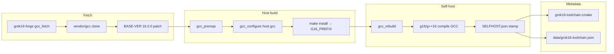

# Grok16 Architecture

Grok16 is a **self-hosted G16 field compiler distribution**: real ELF `g16` / `g++16` drivers at version **16.0.0**, built from upstream **GCC `releases/gcc-15`** with a documented field rewrite. This repository ships **scripts, forge, patches, and CMake metadata** — not prebuilt binaries (GPL source is fetched and built locally).

Default consumer standard is **gnu++26** (`G16_CXX_STD`).

## Field rewrite vs stock GCC

| Aspect | Stock GCC 15 | Grok16 G16 field build |
|--------|----------------|-------------------------|
| Upstream branch | `releases/gcc-15` | Same clone |
| `gcc/BASE-VER` | `15.3.1` | **`16.0.0`** (patched) |
| Driver names | `gcc`, `g++` | **`g16`, `g++16`** (`program-transform-name`) |
| Pkgversion | (default) | **`Grok16-16.0.0`** |
| Identity | Upstream GCC 15 | **Field G16 @ 16.0.0** — not `releases/gcc-16` |

The rewrite is intentional sovereignty branding: one coherent toolchain version string across Queen, World_Redata L2 C++, and CMake consumers, while staying on the maintained gcc-15 tree.

## Build flow

**Bootstrap** (`grok16-toolchain.sh bootstrap`) runs the full host pipeline via `forge/grok16-forge.py run gcc`.

**Rebuild** (`grok16-toolchain.sh rebuild`) distcleans (unless fast mode), reconfigures with `g16`/`g++16` as CC/CXX, runs `make bootstrap` (or `make all` when `G16_DISABLE_BOOTSTRAP=1`), installs, and writes `SELFHOST.json`.

## Speedups (forge + scripts)

Queen forge integration and `forge/compiler_tools.py` share speed controls:

| Env var | Effect |
|---------|--------|
| `GROK16_BUILD_JOBS` | `MAKEFLAGS=-jN` (default `nproc`) |
| `G16_FAST_REBUILD=1` | Skip `distclean`; incremental `make`; auto `G16_DISABLE_BOOTSTRAP=1` |
| `G16_DISABLE_BOOTSTRAP=1` | `make all` instead of 3-stage bootstrap |
| `G16_ENABLE_LTO=1` | `--enable-lto` at configure; LTO flags on make (thin when g++16 supports it) |
| `G16_ENABLE_PGO=1` | Profile-generate/use flags from `data/grok16-profiles.json` |
| `GROK16_USE_CCACHE=1` | Prefix CC/CXX with `ccache` when installed |

`forge/grok16_lto.py` probes the installed `g++16` and picks `-flto=thin` or `-flto` for profile link flags and rebuild make env.

**Bench** (`grok16-toolchain.sh bench`) compiles `examples/ai-matrix-bench` with profile flags from `scripts/grok16-profile-flags.py` and reports compile time, run time, and binary size to `data/bench/` (gitignored).

## Field-aware compiler (vs stock GCC)

Grok16 does not ship a forked GCC IR — it **configures and profiles** the field build for measurable throughput on representative workloads:

| Layer | Field tuning |
|-------|----------------|
| Forge rebuild | `G16_FIELD_SPEED` / `G16_RELEASE_PROFILE` → LTO, vectorize, unroll on `make` |
| Consumer profiles | `field_opt`, `ai`, `field_compute`, `vulkan_rtx` in `data/grok16-profiles.json` |
| Benchmarks | `field-bench` (FieldX86 + entropy + NEXUS), `bench-all`, PGO via `profile` |
| Macros | `FIELD_ENTROPY_DISPATCH`, `FIELD_X86_DIE`, `FIELD_WAVE_PHASE`, `G16_FIELD_SPEED` |

Default rebuild is **fast iteration** (`G16_FAST_REBUILD=1`). Production: `G16_RELEASE_PROFILE=1` enables LTO + PGO + field_opt.

## AI / gnu++26 profiles

`data/grok16-profiles.json` defines four consumer profiles:

| Profile | Focus |
|---------|--------|
| `field_opt` | **Primary** — entropy fold, wave phase, FieldX86 dispatch, NEXUS scoring |
| `ai` | Matrix-friendly `-O3`, vectorize, unroll; `GROK16_PROFILE_AI` |
| `field_compute` | OpenMP SIMD, vector cost model; `FIELD_X86_DIE`, CANVAS-style kernels |
| `vulkan_rtx` | AVX2/FMA, AMOURANTHRTX-style CPU prep |

CMake wrappers: `cmake/grok16-profile-{ai,field,vulkan}.cmake` — include via `-DCMAKE_PROJECT_INCLUDE=...` after `grok16-toolchain.cmake`.

Examples:

- `examples/ai-matrix-bench/` — bench source
- `examples/field-canvas-kernel/` — entropy/wave dispatch kernel
- `examples/minimal-cmake-project/` — smoke consumer

## Directory roles

| Path | Role |
|------|------|
| `forge/` | Python forge — `compiler_tools.py`, `grok16-forge.py`, `grok16_lto.py` |
| `vendor/gcc/` | Upstream clone (local, ~1.6G, gitignored) |
| `build/gcc/` | Configure/make tree (local, ~4G, gitignored) |
| `bin/` `lib/` `libexec/` | Install prefix (`G16_PREFIX`, gitignored) |
| `cmake/grok16-toolchain.cmake` | Generated CMake toolchain file (local) |
| `cmake/grok16-profile-*.cmake` | AI / Field / RTX profile fragments (in git) |
| `data/grok16-toolchain.json` | Machine-readable status manifest (generated) |
| `data/grok16-profiles.json` | Profile and PGO flag definitions |
| `patches/` | Documented field deltas |
| `examples/` | CMake consumers and benchmarks |

## Configuration

All paths are **environment-driven** (no hardcoded Desktop layout). See `data/grok16-config.json`.

| Variable | Default when unset |
|----------|-------------------|
| `GROK16_ROOT` | Repo root (auto from `scripts/`) |
| `G16_PREFIX` | `$GROK16_ROOT` |
| `GROK16_SG_ROOT` | Parent of `GROK16_ROOT` |
| `GROK16_QUEEN_ROOT` | `$GROK16_SG_ROOT/NewLatest/Queen` |
| `GROK16_GCC_SRC` | `$GROK16_ROOT/vendor/gcc` |
| `GROK16_GCC_BUILD` | `$GROK16_ROOT/build/gcc` |
| `GROK16_GCC_REPO` | `https://gcc.gnu.org/git/gcc.git` |
| `GROK16_GCC_BRANCH` | `releases/gcc-15` |
| `G16_PKGVERSION` | `Grok16-16.0.0` |
| `G16_CXX_STD` | `gnu++26` |
| `G16_DISABLE_BOOTSTRAP` | unset → bootstrap on rebuild |
| `G16_FAST_REBUILD` | unset; `1` → dev fast path |
| `GROK16_BUILD_JOBS` | `nproc` |

`scripts/grok16-config.sh` resolves these for shell entry points; `ForgeContext.from_env()` reads `GROK16_ROOT` and job count for Python.

## Self-host and verification

After rebuild, `G16_PREFIX/SELFHOST.json` records:

- `selfhosted: true`
- `bootstrap` flag (whether 3-stage bootstrap ran)
- Paths to `g16` / `g++16` and pkgversion

`./scripts/grok16-toolchain.sh verify` checks driver version, compiles a gnu++26 probe (`-c`), and optionally builds `examples/minimal-cmake-project` when CMake is available.

`./scripts/grok16-toolchain.sh bench` exercises AI profile flags end-to-end (compile + run).

## Queen and consolidate

Queen historically hosted the gcc clone and forge probes. **Grok16 is the canonical home** for the G16 tree on the SG desktop. `scripts/consolidate.sh` moves Queen `vendor/gcc` and `build/gcc` into Grok16 (paths configurable via `GROK16_QUEEN_ROOT`) and symlinks Queen `vendor/gcc` → Grok16 source.

Queen `compiler_probe` / `g16-toolchain.json` can point at Grok16's prefix after install.

## Integration with the SG stack

Grok16 is the **L5 toolchain layer** in the World_Redata methodology (assembly view L0–L5):

- **World_Redata L2** — C++ engine built with `g++16` via `build-cpp.sh` and `field_g16.hh` contracts.
- **World_Redata gates** — `security`, `asm`, and `parity` assume a real G16 @ 16.0.0 (no bash wrappers).
- **Queen forge** — `compiler_probe` writes `g16-toolchain.json`; Grok16 forge is the standalone equivalent with cache/LTO/PGO hooks.
- **Hostess7 / ZAC / redata** — lossless segments and plates are format layers (L0–L1); Grok16 compiles the native L2 engine that roundtrips those bytes.
- **Field_Primer** — treat Grok16 as the sovereign C/C++ build requirement: bootstrap once, verify, bench, then point CMake at `grok16-toolchain.cmake` and optional AI profiles.

Set `G16_PREFIX` (or symlink Queen prefix) so downstream manifests resolve the same ELF drivers.

## Licensing

- **GCC** — GPLv3 (FSF). Runtime libraries may use GCC Runtime Library Exception.
- **Grok16 scripts/forge** — GPLv3, Copyright (C) 2026 Zachary Geurts.

See [LICENSE](LICENSE) and [CREDITS.md](CREDITS.md).

## Releases (planned)

When stable: tag `v16.0.0-beta.1`, document optional binary tarball **outside git** (install prefix archive), keep source-of-truth in forge bootstrap.