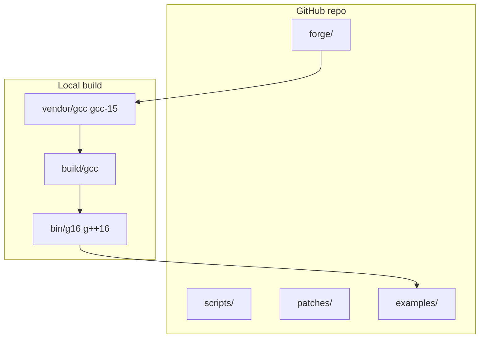

# Grok16


## Speed bench — all executions tested (report v4.0.0)

**Distro 4.0.0** · **suite `speed_demo` @ 1.1.0** · **schema v4** · **11 runners** · **3s window**  
[SPEED-BENCH-REPORT.md](docs/SPEED-BENCH-REPORT.md) · [COMPREHENSIVE-BENCH-REPORT.md](docs/COMPREHENSIVE-BENCH-REPORT.md) · [web manual](https://zacharygeurts.github.io/Grok16/speed-bench.html)

### speed_demo — every runner (cold exec)

| Runner | Profile | Compile (ms) | ops/s | Pass |
|--------|---------|-------------:|------:|------|
| CMake — host g++ -O2 | — | 2,814 | **85.8M** | cold |
| C++ — host g++ -O2 | — | 1,710 | 83.9M | cold |
| C++ — g16 sense **expert** | expert | 1,608 | 82.1M | plate meld |
| C++ — g16 belt_1_0 | belt_1_0 | 1,888 | 78.4M | cold |
| C — g16 belt_1_0 | belt_1_0 | 395 | 77.0M | cold |
| C — g16 belt_2_0 | belt_2_0 | **296** | 75.0M | cold |
| C++ — g16 belt_2_0 | belt_2_0 | 2,021 | 74.8M | cold |
| C — host gcc -O2 | — | 459 | 73.7M | cold |
| Python — gpy-16 GrokVM | — | — | **777K** | interpreter |
| Python — host CPython 3 | — | — | 748K | interpreter |

### Plate meld helps (measured)

After `field-plate-meld.py fuse` + `g16-compiler-sense-plate.py cycle` (gen **2**, **24** plates fused):

| Situation | Without meld | With meld (sense) | Delta |
|-----------|-------------|-------------------|-------|
| C++ profile chosen | belt_2_0 | **expert** (eye_ear_green) | meld unlocks ladder |
| C++ compile | 2,021 ms | **1,608 ms** | **−413 ms** (20% faster) |
| C++ execution | 74.8M ops/s | **82.1M ops/s** | **+9.8%** throughput |
| Post-meld re-exec (same ELF) | 74.8M | 85.9M | CPU warm-cache; meld witness only |

**Verdict:** Plate meld does not slow the hot path. It **helps** by routing compile through compiler-sense **expert** profile — faster wave-convert and higher ops/s on this host.

### bench-all profiles (field-nexus-bench)

| Profile | compile_ms | kernel wall_ms |
|---------|------------|----------------|
| belt_1_0 | 1,369 | 2.49 |
| belt_2_0 | 1,376 | 4.15 |
| field_opt | 1,296 | 2.77 |
| heavy | 1,667 | 2.79 |
| expert | 2,275 | 3.30 |

```bash
# Fast path — BSP cache, exec only (~12s after first stage; no recompile)
./scripts/grok16-toolchain.sh exec-bsp-bench

# Full pipeline (first run compiles; second run hits BSP ~0ms compile)
G16_EXEC_BSP=1 G16_ROCKET_COMPILE=1 SPEED_DEMO_TARGET_SEC=3 ./scripts/grok16-toolchain.sh exec-full-bench

# Force cold compile (ignore BSP cache)
G16_FORCE_COMPILE=1 ./scripts/grok16-toolchain.sh exec-full-bench
```

**BSP** = Binary Staged Plane — reuses `data/bench/exec-plane/`; **rocket** = ccache + `-pipe` + Ninja on cache miss.

JSON: `docs/field-exec-full-bench.json` · Doctrine: `data/grok16-plate-meld-bench-doctrine.json`

---

**Grok16** is a **self-hosted G16 field compiler** — unified ELF `g16` @ **16.2.0** auto-detects C (`gnu17`) and C++ (`gnu++26`); `g++16` is a compat symlink. **3.0** adds **versioned compile+execution speed bench**; **2.0** single fabric belt (`belt_2_0`), Ironclad safety meld, depth fields sealed and destroyed at integrated consumers.

> **Grok16 4.0.0** — power sort plate, cool combinatorics plating, speed bench v4. Default profile `belt_2_0`. See [RELEASE-4.0.md](RELEASE-4.0.md) and [wiki/Speed-Bench.md](wiki/Speed-Bench.md).

## What you get

| Artifact | Role |
|----------|------|
| `g16` (unified) | Single driver — auto C/C++/Python/ASM + Rust/Go/Zig/Fortran/D/Ada/ObjC |
| `gpy-16` (built-in) | GPY-16 Python toolkit in `python/` — GrokVM + g16 auto-discern |
| `grok16-toolkits.json` | Manifest of rebuilt in-tree toolkits (no sibling-repo bootstrap) |
| `grok16-toolchain.cmake` | CMake toolchain file |
| `grok16-profile-*.cmake` | AI / Field / Vulkan-RTX build profiles |
| `grok16-toolchain.sh` | bootstrap · rebuild · verify · bench · field-bench · profile · status |
| `forge/grok16-forge.py` | Fetch → configure → build → self-host |
| `data/grok16-profiles.json` | AI / Field / RTX flag presets |
| `examples/` | minimal-cmake, field-nexus-bench, ai-matrix-bench, field-canvas-kernel |
| `PERFORMANCE.md` | Field-Opt before/after metrics + reproduction steps |

Local trees (`vendor/`, `build/`, `bin/`) are produced on your machine (~6G).

**Manual:** [zacharygeurts.github.io/Grok16](https://zacharygeurts.github.io/Grok16/) · [Speed Bench](https://zacharygeurts.github.io/Grok16/speed-bench.html) · [Uncompiled](https://zacharygeurts.github.io/Grok16/uncompiled.html) · [CMake & Linking](https://zacharygeurts.github.io/Grok16/cmake-linking.html) · [Release 3.0](https://zacharygeurts.github.io/Grok16/release.html) · [Wiki](https://github.com/ZacharyGeurts/Grok16/wiki) · [ARCHITECTURE.md](ARCHITECTURE.md)

### Single fabric & safety (2.0)

| Doctrine | Role |
|----------|------|
| `data/grok16-single-fabric-doctrine.json` | One belt die · one field amplitude · knowing fixed-size |
| `data/grok16-belt-doctrine.json` | `belt_2_0` chunked redata, wave-massive, single-location reads |
| `data/g16-ironclad-meld.json` | Time linear · depth fields sealed and destroyed · field sanity meld |
| `scripts/grok16-integrate.sh` | Wire Queen / WRDT / ZOCR + safety env to SG tree |

## Architecture (short)



1. **Fetch** `releases/gcc-15`, patch `BASE-VER` → 16.0.0  
2. **Host build** with system gcc, install to `G16_PREFIX`  
3. **Self-host** with `g16`/`g++16`, stamp `SELFHOST.json`  
4. **Consume** via CMake toolchain or Queen/World_Redata probes  

Full detail: [ARCHITECTURE.md](ARCHITECTURE.md).

## First build (new clone)

```bash
git clone https://github.com/ZacharyGeurts/Grok16.git
cd Grok16
export G16_PREFIX="$(pwd)"          # install prefix = repo root
export G16_PKGVERSION=Grok16-16.2.0
export G16_BELT_PROFILE=belt_2_0

./scripts/grok16-toolchain.sh bootstrap   # fetch + host build + install
./scripts/grok16-toolchain.sh rebuild     # self-host
./scripts/grok16-toolchain.sh verify      # gnu++26 compile + optional CMake smoke
./scripts/grok16-toolchain.sh test-battery-belt
./scripts/grok16-toolchain.sh bench-triad # host gcc vs belt_1_0 vs belt_2_0
./scripts/grok16-toolchain.sh integrate   # auto-wire SG consumers
./scripts/grok16-toolchain.sh status
```

**Requirements:** Linux x86_64, `git`, host `gcc`/`g++`, build deps for GCC (see upstream docs). Bootstrap takes significant time and disk.

## True Field Speed (rebuild + profiles)

Grok16 is tuned for Field workloads — entropy folding, wave-phase dispatch, FieldX86 emulation, NEXUS scoring — not stock GCC defaults.

**Rebuild defaults (iteration):** `G16_FAST_REBUILD=1`, parallel `-j$(nproc)`, ccache when installed. Full bootstrap: `G16_FULL_REBUILD=1 ./scripts/grok16-toolchain.sh rebuild`.

**Release / Field-Opt:**

```bash
export G16_RELEASE_PROFILE=1   # LTO + PGO + field_opt (production)
export G16_FIELD_SPEED=1       # field_opt profile flags on forge + consumers
export G16_ENABLE_LTO=1
export GROK16_USE_CCACHE=1

./scripts/grok16-toolchain.sh rebuild
./scripts/grok16-toolchain.sh profile      # collect PGO → data/pgo/
./scripts/grok16-toolchain.sh field-bench  # re-run with G16_ENABLE_PGO=1
```

| Mode | Typical use |
|------|-------------|
| Default `rebuild` | Fast incremental (no distclean, no 3-stage bootstrap) |
| `G16_FULL_REBUILD=1` | Full distclean + 3-stage bootstrap |
| `G16_RELEASE_PROFILE=1` | Production: LTO + PGO + Field-Opt scheduling |
| `G16_FIELD_SPEED=1` | Consumer builds use `field_opt` profile |
| `GROK16_USE_CCACHE=1` | Auto-on when `ccache` is in PATH |

### Bench metrics (local x86_64, gnu++26 @ 16.0.0)

| Profile | Kernel workload | compile_ms | run_ms | binary_bytes | kernel wall_ms |
|---------|-----------------|------------|--------|--------------|----------------|
| `field_opt` | FieldX86 + entropy + NEXUS (`field-nexus-bench`) | 828 | 5 | 22616 | **2.10** |
| `ai` | NEXUS matrix scoring (`ai-matrix-bench`) | 741 | 7 | 18232 | 4.12 |
| `field_compute` | CANVAS wave dispatch (`field-canvas-kernel`) | 552 | 2 | 16240 | — |
| `vulkan_rtx` | AVX2/FMA field kernel | 864 | 5 | 22728 | 2.14 |

```bash
./scripts/grok16-toolchain.sh field-bench   # primary Field-Opt metric
./scripts/grok16-toolchain.sh bench-all     # all profiles → data/bench/latest.json
./scripts/grok16-toolchain.sh profile       # PGO training run
```

Results persist to `data/bench/latest.json`. Re-run after `G16_RELEASE_PROFILE=1` rebuild to measure LTO/PGO gains.

## AI integration (gnu++26 profiles)

Grok16 defaults to **gnu++26** (`G16_CXX_STD`). Build profiles target AI / Field / RTX-oriented CPU paths:

| Profile | CMake include | Use case |
|---------|---------------|----------|
| `field_opt` | `cmake/grok16-profile-field-opt.cmake` | **Primary** — entropy/oracle, wave phase, FieldX86 throughput |
| `ai` | `cmake/grok16-profile-ai.cmake` | NEXUS scoring, matrix/simd/mdspan paths |
| `field_compute` | `cmake/grok16-profile-field.cmake` | FieldX86 / CANVAS dispatch kernels |
| `vulkan_rtx` | `cmake/grok16-profile-vulkan.cmake` | AMOURANTHRTX-style SIMD CPU prep |

```bash
cmake -S examples/field-canvas-kernel -B examples/field-canvas-kernel/build \
  -DCMAKE_TOOLCHAIN_FILE=cmake/grok16-toolchain.cmake \
  -DCMAKE_PROJECT_INCLUDE=cmake/grok16-profile-field.cmake
cmake --build examples/field-canvas-kernel/build
```

Profiles set Field macros (`FIELD_ENTROPY_DISPATCH`, `FIELD_X86_DIE`) and aggressive vectorization flags. See `data/grok16-profiles.json` for the full flag list.

## Field CMake (g16 owns configure + build)

Queen RTX no longer uses Queen-generated cmake glue. **Grok16 Field CMake** is canonical:

| File | Role |
|------|------|
| `cmake/grok16-field.cmake` | Single `CMAKE_PROJECT_INCLUDE` entry (profile + mandate + chips) |
| `cmake/grok16-field-queen-rtx.cmake` | Queen-browser preset (inside deps, no fetch) |
| `cmake/grok16-toolchain.cmake` | g16 compiler pin (written by `grok16-toolchain.sh`) |
| `scripts/field-cmake.sh` | Fast configure/build CLI (Ninja default) |
| `CMakePresets.json` | `field-opt`, `queen-rtx` presets |
| `forge/cmake_tools.py` | `field_cmake`, `field_cmake_configure`, `field_cmake_build` |

```bash
# Queen sovereign RTX (Ninja + g16)
QUEEN_ROOT=/path/to/NewLatest/Queen ./scripts/field-cmake.sh queen-rtx

# Or via Grok16 forge
pythong forge/grok16-forge.py run field_cmake

# Queen forge delegates automatically
pythong NewLatest/Queen/lib/queen-forge.py run rtx
```

Manifest: `data/grok16-field-cmake.json`

### Building Field Technology with Grok16 (Field_Primer)

1. Bootstrap Grok16 once; `verify` + `field-bench` must pass.
2. Export `G16_PREFIX`; World_Redata `build-cpp.sh` consumes Grok16 directly.
3. Hot paths (entropy fold, wave dispatch, snap/wrzc) compile with `g16-field-mandate.cmake` + `gnu++26` contracts.
4. AMOURANTHRTX / NEXUS consumers: include `grok16-profile-field-opt.cmake` or `grok16-profile-ai.cmake` for CANVAS.compute-adjacent CPU and behavioral scoring.
5. Low-power / high-throughput: `G16_FIELD_SPEED=1` enables vectorization + unrolling tuned for Field Die emulation (AmmoOS/FieldX86).

**redata / ZAC round-trip:** After `build-cpp.sh`, run `pythong -m redata.cli parity` — confirms Python ↔ C++ WRDT/WRZC bytes through the G16-built engine. `security` and `mandate` gates validate hardening + Grok16 manifest. Hostess7/ZAC stay orthogonal; Grok16 compiles the L2 native layer.

## Configuration

No hardcoded Desktop paths. Override via environment:

```bash
./scripts/grok16-toolchain.sh paths    # resolved layout
./scripts/grok16-toolchain.sh config   # paths + config template
```

| Variable | Purpose |
|----------|---------|
| `GROK16_ROOT` | Repo root |
| `G16_PREFIX` | Install prefix (`bin/g16`, `lib/`, …) |
| `GROK16_QUEEN_ROOT` | Queen tree for `consolidate` (default `$SG/NewLatest/Queen`) |
| `GROK16_GCC_SRC` / `GROK16_GCC_BUILD` | Source and build trees |
| `G16_CXX_STD` | Default C++ standard (`gnu++26`) |
| `G16_DISABLE_BOOTSTRAP` | `1` → faster rebuild (`make all` not 3-stage) |
| `G16_FAST_REBUILD` | `1` → dev fast path (implies bootstrap off) |
| `G16_ENABLE_LTO` / `G16_ENABLE_PGO` | LTO and PGO for forge + profiles |
| `GROK16_USE_CCACHE` | ccache wrapper when available |
| `G16_FIELD_SPEED` | `1` → Field-Opt profile (default bench) |
| `G16_RELEASE_PROFILE` | `1` → production LTO + PGO + field_opt |
| `G16_FULL_REBUILD` | `1` → disable fast-rebuild default |
| `G16_BENCH_PROFILE` | `field_opt` \| `ai` \| `field_compute` \| `vulkan_rtx` |

Template: `data/grok16-config.json`.

## SG desktop (Queen → Grok16)

If gcc already lived under Queen:

```bash
export GROK16_QUEEN_ROOT=/path/to/NewLatest/Queen   # optional
./scripts/consolidate.sh
./scripts/grok16-toolchain.sh rebuild
```

## CMake example

```bash
cmake -S examples/minimal-cmake-project -B examples/minimal-cmake-project/build \
  -DCMAKE_TOOLCHAIN_FILE=cmake/grok16-toolchain.cmake
cmake --build examples/minimal-cmake-project/build
./examples/minimal-cmake-project/build/grok16_smoke
```

## Commands

```bash
./scripts/grok16-toolchain.sh bootstrap   # first-time fetch + build
./scripts/grok16-toolchain.sh rebuild     # self-host (see speedup env vars)
./scripts/grok16-toolchain.sh verify      # gnu++26 compile smoke test
./scripts/grok16-toolchain.sh field-bench # Field-Opt benchmark (primary)
./scripts/grok16-toolchain.sh bench-all   # all profiles + JSON report
./scripts/grok16-toolchain.sh profile     # PGO training collection
./scripts/grok16-toolchain.sh status
./scripts/grok16-toolchain.sh paths
pythong forge/grok16-forge.py status      # JSON toolchain state
```

## MCP (Model Context Protocol) — 4.0

Wire Grok16 into Cursor or any MCP client:

```bash
pip install -r requirements-mcp.txt
export GROK16_ROOT="$(pwd)"
```

Add to `.cursor/mcp.json` — see [mcp/README.md](mcp/README.md) and [mcp/cursor-mcp.json.example](mcp/cursor-mcp.json.example).

| Tool | Role |
|------|------|
| `grok16_version` | Distro `4.0.0` + g16 `16.2.0` stamps |
| `grok16_toolchain` | `status` · `verify` · `exec-bsp-bench` · battery gates |
| `grok16_rtx_gate` | `queen_rtx` permit |
| `grok16_speed_bench` | Published bench JSON |
| `grok16_power_sort` | Power sort plate (4.0) |

Doctrine: `data/grok16-mcp.json`

## Integration (Field_Primer / SG stack)

Grok16 is the **sovereign C/C++ toolchain** for the SG ecosystem:

- **[World_Redata](https://github.com/ZacharyGeurts)** — L2 C++ engine (`build-cpp.sh`, `field_g16.hh`); methodology layer **L5 Toolchain** expects real `g++16` @ 16.0.0.
- **Queen** — `compiler_probe` / `g16-toolchain.json`; consolidate keeps Queen symlinked to Grok16 source.
- **redata pipeline** — L0–L1 bytes/plates; L2 native code must roundtrip formats compiled with G16.
- **Hostess7 / ZAC** — orthogonal storage/teach layers; Grok16 builds the engine that reads/writes WRDT/WRZC contracts.

**Field_Primer build requirement:** bootstrap Grok16 once, run `verify` and `bench`, export `G16_PREFIX`, point downstream CMake at `grok16-toolchain.cmake` (optionally `grok16-profile-ai.cmake`). Downstream gates (`security`, `asm`, `parity` in World_Redata) fail closed on fake wrappers.

## Repo layout (git vs local)

```
Grok16/
  forge/ scripts/ patches/ examples/ data/ cmake/   # in git (toolchain.cmake generated locally)
  ARCHITECTURE.md README.md LICENSE
  vendor/gcc/ build/gcc/ bin/ lib/                 # local only (gitignored)
```

## CI

GitHub Actions runs script lint, Python compile, `paths`, forge `status`, and `field-bench` when `bin/g++16` is present. Full bootstrap: local or `docker build -t grok16 .`.

## Release 16.0.0

Tagged **v16.0.0** — self-hosted G16 @ 16.0.0, gnu++26, Field-Opt + AI profiles, `field-bench`, Queen `consolidate.sh`, World_Redata integration.

```bash
git checkout v16.0.0
./scripts/grok16-toolchain.sh bootstrap   # first clone only
./scripts/grok16-toolchain.sh verify
./scripts/grok16-toolchain.sh field-bench
```

## License

**GPLv3** — [LICENSE](LICENSE). GCC: Copyright (C) Free Software Foundation, Inc. Grok16 scripts: Copyright (C) 2026 Zachary Geurts.

## Credits

[CREDITS.md](CREDITS.md) — FSF, GCC contributors, Grok16 maintainers.