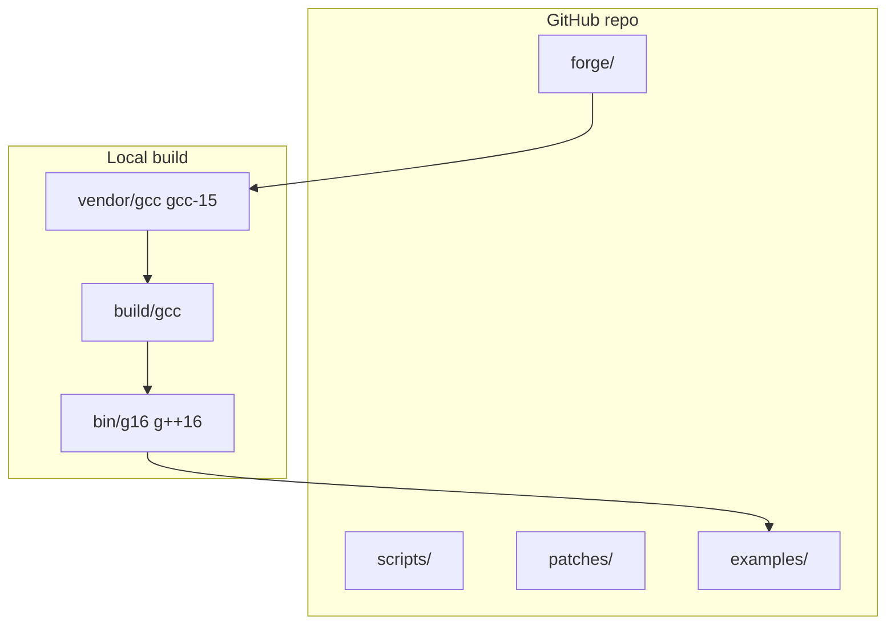

# Grok16


**Grok16** is a **self-hosted G16 field compiler** — real ELF `g16` / `g++16` @ **16.0.0**, **gnu++26**-capable, built via the Grok16 forge. Scripts and CMake integration ship in git; **no prebuilt binaries** (reproducible bootstrap from GPL GCC sources).

> **Beta** — APIs and layout may change before 1.0. This is a **gcc-15 field rewrite** (BASE-VER 16.0.0), not upstream `releases/gcc-16`.

## What you get

| Artifact | Role |
|----------|------|
| `g16` / `g++16` | C and C++ drivers (pkgversion `Grok16-16.0.0`) |
| `grok16-toolchain.cmake` | CMake toolchain file |
| `grok16-profile-*.cmake` | AI / Field / Vulkan-RTX build profiles |
| `grok16-toolchain.sh` | bootstrap · rebuild · verify · bench · field-bench · profile · status |
| `forge/grok16-forge.py` | Fetch → configure → build → self-host |
| `data/grok16-profiles.json` | AI / Field / RTX flag presets |
| `examples/` | Minimal CMake, matrix bench, Field dispatch kernel |

Local trees (`vendor/`, `build/`, `bin/`) are produced on your machine (~6G). See [ARCHITECTURE.md](ARCHITECTURE.md).

## Architecture (short)



1. **Fetch** `releases/gcc-15`, patch `BASE-VER` → 16.0.0  
2. **Host build** with system gcc, install to `G16_PREFIX`  
3. **Self-host** with `g16`/`g++16`, stamp `SELFHOST.json`  
4. **Consume** via CMake toolchain or Queen/World_Redata probes  

Full detail: [ARCHITECTURE.md](ARCHITECTURE.md).

## First build (new clone)

```bash
git clone https://github.com/ZacharyGeurts/Grok16.git
cd Grok16
export G16_PREFIX="$(pwd)"          # install prefix = repo root
export G16_PKGVERSION=Grok16-16.0.0

./scripts/grok16-toolchain.sh bootstrap   # fetch + host build + install
./scripts/grok16-toolchain.sh rebuild     # self-host
./scripts/grok16-toolchain.sh verify      # gnu++26 compile + optional CMake smoke
./scripts/grok16-toolchain.sh bench       # Field/AI matrix micro-benchmark
./scripts/grok16-toolchain.sh status
```

**Requirements:** Linux x86_64, `git`, host `gcc`/`g++`, build deps for GCC (see upstream docs). Bootstrap takes significant time and disk.

## True Field Speed (rebuild + profiles)

Grok16 is tuned for Field workloads — entropy folding, wave-phase dispatch, FieldX86 emulation, NEXUS scoring — not stock GCC defaults.

**Rebuild defaults (iteration):** `G16_FAST_REBUILD=1`, parallel `-j$(nproc)`, ccache when installed. Full bootstrap: `G16_FULL_REBUILD=1 ./scripts/grok16-toolchain.sh rebuild`.

**Release / Field-Opt:**

```bash
export G16_RELEASE_PROFILE=1   # LTO + PGO + field_opt (production)
export G16_FIELD_SPEED=1       # field_opt profile flags on forge + consumers
export G16_ENABLE_LTO=1
export GROK16_USE_CCACHE=1

./scripts/grok16-toolchain.sh rebuild
./scripts/grok16-toolchain.sh profile      # collect PGO → data/pgo/
./scripts/grok16-toolchain.sh field-bench  # re-run with G16_ENABLE_PGO=1
```

| Mode | Typical use |
|------|-------------|
| Default `rebuild` | Fast incremental (no distclean, no 3-stage bootstrap) |
| `G16_FULL_REBUILD=1` | Full distclean + 3-stage bootstrap |
| `G16_RELEASE_PROFILE=1` | Production: LTO + PGO + Field-Opt scheduling |
| `G16_FIELD_SPEED=1` | Consumer builds use `field_opt` profile |
| `GROK16_USE_CCACHE=1` | Auto-on when `ccache` is in PATH |

### Bench metrics (local x86_64, gnu++26 @ 16.0.0)

| Profile | Kernel workload | compile_ms | run_ms | binary_bytes | kernel wall_ms |
|---------|-----------------|------------|--------|--------------|----------------|
| `field_opt` | FieldX86 + entropy + NEXUS (`field-nexus-bench`) | 828 | 5 | 22616 | **2.10** |
| `ai` | NEXUS matrix scoring (`ai-matrix-bench`) | 741 | 7 | 18232 | 4.12 |
| `field_compute` | CANVAS wave dispatch (`field-canvas-kernel`) | 552 | 2 | 16240 | — |
| `vulkan_rtx` | AVX2/FMA field kernel | 864 | 5 | 22728 | 2.14 |

```bash
./scripts/grok16-toolchain.sh field-bench   # primary Field-Opt metric
./scripts/grok16-toolchain.sh bench-all     # all profiles → data/bench/latest.json
./scripts/grok16-toolchain.sh profile       # PGO training run
```

Results persist to `data/bench/latest.json`. Re-run after `G16_RELEASE_PROFILE=1` rebuild to measure LTO/PGO gains.

## AI integration (gnu++26 profiles)

Grok16 defaults to **gnu++26** (`G16_CXX_STD`). Build profiles target AI / Field / RTX-oriented CPU paths:

| Profile | CMake include | Use case |
|---------|---------------|----------|
| `field_opt` | `cmake/grok16-profile-field-opt.cmake` | **Primary** — entropy/oracle, wave phase, FieldX86 throughput |
| `ai` | `cmake/grok16-profile-ai.cmake` | NEXUS scoring, matrix/simd/mdspan paths |
| `field_compute` | `cmake/grok16-profile-field.cmake` | FieldX86 / CANVAS dispatch kernels |
| `vulkan_rtx` | `cmake/grok16-profile-vulkan.cmake` | AMOURANTHRTX-style SIMD CPU prep |

```bash
cmake -S examples/field-canvas-kernel -B examples/field-canvas-kernel/build \
  -DCMAKE_TOOLCHAIN_FILE=cmake/grok16-toolchain.cmake \
  -DCMAKE_PROJECT_INCLUDE=cmake/grok16-profile-field.cmake
cmake --build examples/field-canvas-kernel/build
```

Profiles set Field macros (`FIELD_ENTROPY_DISPATCH`, `FIELD_X86_DIE`) and aggressive vectorization flags. See `data/grok16-profiles.json` for the full flag list.

### Building Field Technology with Grok16 (Field_Primer)

1. Bootstrap Grok16 once; `verify` + `field-bench` must pass.
2. Export `G16_PREFIX`; World_Redata `build-cpp.sh` consumes Grok16 directly.
3. Hot paths (entropy fold, wave dispatch, snap/wrzc) compile with `g16-field-mandate.cmake` + `gnu++26` contracts.
4. AMOURANTHRTX / NEXUS consumers: include `grok16-profile-field-opt.cmake` or `grok16-profile-ai.cmake` for CANVAS.compute-adjacent CPU and behavioral scoring.
5. Low-power / high-throughput: `G16_FIELD_SPEED=1` enables vectorization + unrolling tuned for Field Die emulation (AmmoOS/FieldX86).

**redata pipeline:** L0–L1 plates roundtrip through World_Redata L2 built with G16. Hostess7/ZAC layers stay orthogonal; Grok16 compiles the native engine that reads/writes WRDT/WRZC contracts.

## Configuration

No hardcoded Desktop paths. Override via environment:

```bash
./scripts/grok16-toolchain.sh paths    # resolved layout
./scripts/grok16-toolchain.sh config   # paths + config template
```

| Variable | Purpose |
|----------|---------|
| `GROK16_ROOT` | Repo root |
| `G16_PREFIX` | Install prefix (`bin/g16`, `lib/`, …) |
| `GROK16_QUEEN_ROOT` | Queen tree for `consolidate` (default `$SG/NewLatest/Queen`) |
| `GROK16_GCC_SRC` / `GROK16_GCC_BUILD` | Source and build trees |
| `G16_CXX_STD` | Default C++ standard (`gnu++26`) |
| `G16_DISABLE_BOOTSTRAP` | `1` → faster rebuild (`make all` not 3-stage) |
| `G16_FAST_REBUILD` | `1` → dev fast path (implies bootstrap off) |
| `G16_ENABLE_LTO` / `G16_ENABLE_PGO` | LTO and PGO for forge + profiles |
| `GROK16_USE_CCACHE` | ccache wrapper when available |
| `G16_FIELD_SPEED` | `1` → Field-Opt profile (default bench) |
| `G16_RELEASE_PROFILE` | `1` → production LTO + PGO + field_opt |
| `G16_FULL_REBUILD` | `1` → disable fast-rebuild default |
| `G16_BENCH_PROFILE` | `field_opt` \| `ai` \| `field_compute` \| `vulkan_rtx` |

Template: `data/grok16-config.json`.

## SG desktop (Queen → Grok16)

If gcc already lived under Queen:

```bash
export GROK16_QUEEN_ROOT=/path/to/NewLatest/Queen   # optional
./scripts/consolidate.sh
./scripts/grok16-toolchain.sh rebuild
```

## CMake example

```bash
cmake -S examples/minimal-cmake-project -B examples/minimal-cmake-project/build \
  -DCMAKE_TOOLCHAIN_FILE=cmake/grok16-toolchain.cmake
cmake --build examples/minimal-cmake-project/build
./examples/minimal-cmake-project/build/grok16_smoke
```

## Commands

```bash
./scripts/grok16-toolchain.sh bootstrap   # first-time fetch + build
./scripts/grok16-toolchain.sh rebuild     # self-host (see speedup env vars)
./scripts/grok16-toolchain.sh verify      # gnu++26 compile smoke test
./scripts/grok16-toolchain.sh field-bench # Field-Opt benchmark (primary)
./scripts/grok16-toolchain.sh bench-all   # all profiles + JSON report
./scripts/grok16-toolchain.sh profile     # PGO training collection
./scripts/grok16-toolchain.sh status
./scripts/grok16-toolchain.sh paths
python3 forge/grok16-forge.py status      # JSON toolchain state
```

## Integration (Field_Primer / SG stack)

Grok16 is the **sovereign C/C++ toolchain** for the SG ecosystem:

- **[World_Redata](https://github.com/ZacharyGeurts)** — L2 C++ engine (`build-cpp.sh`, `field_g16.hh`); methodology layer **L5 Toolchain** expects real `g++16` @ 16.0.0.
- **Queen** — `compiler_probe` / `g16-toolchain.json`; consolidate keeps Queen symlinked to Grok16 source.
- **redata pipeline** — L0–L1 bytes/plates; L2 native code must roundtrip formats compiled with G16.
- **Hostess7 / ZAC** — orthogonal storage/teach layers; Grok16 builds the engine that reads/writes WRDT/WRZC contracts.

**Field_Primer build requirement:** bootstrap Grok16 once, run `verify` and `bench`, export `G16_PREFIX`, point downstream CMake at `grok16-toolchain.cmake` (optionally `grok16-profile-ai.cmake`). Downstream gates (`security`, `asm`, `parity` in World_Redata) fail closed on fake wrappers.

## Repo layout (git vs local)

```
Grok16/
  forge/ scripts/ patches/ examples/ data/ cmake/   # in git (toolchain.cmake generated locally)
  ARCHITECTURE.md README.md LICENSE
  vendor/gcc/ build/gcc/ bin/ lib/                 # local only (gitignored)
```

## CI

GitHub Actions runs script lint, Python compile, `paths`, forge `status`, and `field-bench` when `bin/g++16` is present. Full bootstrap: local or `docker build -t grok16 .`.

## License

**GPLv3** — [LICENSE](LICENSE). GCC: Copyright (C) Free Software Foundation, Inc. Grok16 scripts: Copyright (C) 2026 Zachary Geurts.

## Credits

[CREDITS.md](CREDITS.md) — FSF, GCC contributors, Grok16 maintainers.