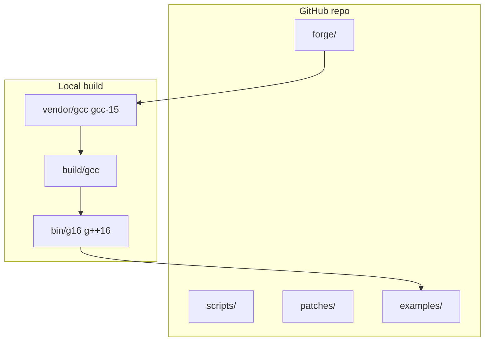

# Grok16


**Grok16** is a **self-hosted G16 field compiler** — real ELF `g16` / `g++16` @ **16.0.0**, **gnu++26**-capable, built via the Grok16 forge. Scripts and CMake integration ship in git; **no prebuilt binaries** (reproducible bootstrap from GPL GCC sources).

> **Beta** — APIs and layout may change before 1.0. This is a **gcc-15 field rewrite** (BASE-VER 16.0.0), not upstream `releases/gcc-16`.

## What you get

| Artifact | Role |
|----------|------|
| `g16` / `g++16` | C and C++ drivers (pkgversion `Grok16-16.0.0`) |
| `grok16-toolchain.cmake` | CMake toolchain file |
| `grok16-profile-*.cmake` | AI / Field / Vulkan-RTX build profiles |
| `grok16-toolchain.sh` | bootstrap · rebuild · verify · bench · status · paths |
| `forge/grok16-forge.py` | Fetch → configure → build → self-host |
| `data/grok16-profiles.json` | AI / Field / RTX flag presets |
| `examples/` | Minimal CMake, matrix bench, Field dispatch kernel |

Local trees (`vendor/`, `build/`, `bin/`) are produced on your machine (~6G). See [ARCHITECTURE.md](ARCHITECTURE.md).

## Architecture (short)



1. **Fetch** `releases/gcc-15`, patch `BASE-VER` → 16.0.0  
2. **Host build** with system gcc, install to `G16_PREFIX`  
3. **Self-host** with `g16`/`g++16`, stamp `SELFHOST.json`  
4. **Consume** via CMake toolchain or Queen/World_Redata probes  

Full detail: [ARCHITECTURE.md](ARCHITECTURE.md).

## First build (new clone)

```bash
git clone https://github.com/ZacharyGeurts/Grok16.git
cd Grok16
export G16_PREFIX="$(pwd)"          # install prefix = repo root
export G16_PKGVERSION=Grok16-16.0.0

./scripts/grok16-toolchain.sh bootstrap   # fetch + host build + install
./scripts/grok16-toolchain.sh rebuild     # self-host
./scripts/grok16-toolchain.sh verify      # gnu++26 compile + optional CMake smoke
./scripts/grok16-toolchain.sh bench       # Field/AI matrix micro-benchmark
./scripts/grok16-toolchain.sh status
```

**Requirements:** Linux x86_64, `git`, host `gcc`/`g++`, build deps for GCC (see upstream docs). Bootstrap takes significant time and disk.

## Speedups (rebuild path)

Parallel make, LTO, PGO, and fast dev rebuild are controlled by environment variables:

```bash
export G16_FAST_REBUILD=1      # skip distclean, incremental make, auto G16_DISABLE_BOOTSTRAP=1
export G16_ENABLE_LTO=1        # --enable-lto at configure; -flto on make (thin when supported)
export G16_ENABLE_PGO=1        # profile-generate/use flags for bench and consumers
export GROK16_USE_CCACHE=1     # wrap CC/CXX with ccache when installed
export GROK16_BUILD_JOBS=$(nproc)

./scripts/grok16-toolchain.sh rebuild
```

| Mode | Typical use |
|------|-------------|
| Default rebuild | Full distclean + 3-stage bootstrap |
| `G16_FAST_REBUILD=1` | Day-to-day dev: incremental link, no bootstrap |
| `G16_ENABLE_LTO=1` | Toolchain built with LTO; profiles use resolved `-flto` / `-flto=thin` |
| `GROK16_USE_CCACHE=1` | Cache reuse across repeated forge runs |

### Bench metrics

`bench` compiles `examples/ai-matrix-bench` with a profile from `data/grok16-profiles.json` and reports wall time + binary size:

```bash
./scripts/grok16-toolchain.sh bench
G16_BENCH_PROFILE=field_compute ./scripts/grok16-toolchain.sh bench
G16_BENCH_PROFILE=vulkan_rtx ./scripts/grok16-toolchain.sh bench
```

Example output:

```
bench: profile=ai std=gnu++26
bench: compile_ms=842 run_ms=12 binary_bytes=24576
bench: PASS
```

Record numbers before/after `G16_ENABLE_LTO=1` rebuild or `GROK16_USE_CCACHE=1` to track local speedups.

## AI integration (gnu++26 profiles)

Grok16 defaults to **gnu++26** (`G16_CXX_STD`). Build profiles target AI / Field / RTX-oriented CPU paths:

| Profile | CMake include | Use case |
|---------|---------------|----------|
| `ai` | `cmake/grok16-profile-ai.cmake` | NEXUS scoring, matrix-heavy loops |
| `field_compute` | `cmake/grok16-profile-field.cmake` | FieldX86 / CANVAS dispatch kernels |
| `vulkan_rtx` | `cmake/grok16-profile-vulkan.cmake` | AMOURANTHRTX-style SIMD CPU prep |

```bash
cmake -S examples/field-canvas-kernel -B examples/field-canvas-kernel/build \
  -DCMAKE_TOOLCHAIN_FILE=cmake/grok16-toolchain.cmake \
  -DCMAKE_PROJECT_INCLUDE=cmake/grok16-profile-field.cmake
cmake --build examples/field-canvas-kernel/build
```

Profiles set Field macros (`FIELD_ENTROPY_DISPATCH`, `FIELD_X86_DIE`) and aggressive vectorization flags. See `data/grok16-profiles.json` for the full flag list.

**Field_Primer / redata:** Grok16 is the sovereign C/C++ layer for World_Redata L2 — bootstrap once, `verify`, export `G16_PREFIX`, point downstream CMake at `grok16-toolchain.cmake`. L0–L1 plates roundtrip through the native engine compiled with G16; Queen `compiler_probe` and `g16-toolchain.json` should resolve the same prefix after `consolidate`.

## Configuration

No hardcoded Desktop paths. Override via environment:

```bash
./scripts/grok16-toolchain.sh paths    # resolved layout
./scripts/grok16-toolchain.sh config   # paths + config template
```

| Variable | Purpose |
|----------|---------|
| `GROK16_ROOT` | Repo root |
| `G16_PREFIX` | Install prefix (`bin/g16`, `lib/`, …) |
| `GROK16_QUEEN_ROOT` | Queen tree for `consolidate` (default `$SG/NewLatest/Queen`) |
| `GROK16_GCC_SRC` / `GROK16_GCC_BUILD` | Source and build trees |
| `G16_CXX_STD` | Default C++ standard (`gnu++26`) |
| `G16_DISABLE_BOOTSTRAP` | `1` → faster rebuild (`make all` not 3-stage) |
| `G16_FAST_REBUILD` | `1` → dev fast path (implies bootstrap off) |
| `G16_ENABLE_LTO` / `G16_ENABLE_PGO` | LTO and PGO for forge + profiles |
| `GROK16_USE_CCACHE` | ccache wrapper when available |
| `G16_BENCH_PROFILE` | `ai` \| `field_compute` \| `vulkan_rtx` |

Template: `data/grok16-config.json`.

## SG desktop (Queen → Grok16)

If gcc already lived under Queen:

```bash
export GROK16_QUEEN_ROOT=/path/to/NewLatest/Queen   # optional
./scripts/consolidate.sh
./scripts/grok16-toolchain.sh rebuild
```

## CMake example

```bash
cmake -S examples/minimal-cmake-project -B examples/minimal-cmake-project/build \
  -DCMAKE_TOOLCHAIN_FILE=cmake/grok16-toolchain.cmake
cmake --build examples/minimal-cmake-project/build
./examples/minimal-cmake-project/build/grok16_smoke
```

## Commands

```bash
./scripts/grok16-toolchain.sh bootstrap   # first-time fetch + build
./scripts/grok16-toolchain.sh rebuild     # self-host (see speedup env vars)
./scripts/grok16-toolchain.sh verify      # gnu++26 compile smoke test
./scripts/grok16-toolchain.sh bench       # matrix benchmark + timings
./scripts/grok16-toolchain.sh status
./scripts/grok16-toolchain.sh paths
python3 forge/grok16-forge.py status      # JSON toolchain state
```

## Integration (Field_Primer / SG stack)

Grok16 is the **sovereign C/C++ toolchain** for the SG ecosystem:

- **[World_Redata](https://github.com/ZacharyGeurts)** — L2 C++ engine (`build-cpp.sh`, `field_g16.hh`); methodology layer **L5 Toolchain** expects real `g++16` @ 16.0.0.
- **Queen** — `compiler_probe` / `g16-toolchain.json`; consolidate keeps Queen symlinked to Grok16 source.
- **redata pipeline** — L0–L1 bytes/plates; L2 native code must roundtrip formats compiled with G16.
- **Hostess7 / ZAC** — orthogonal storage/teach layers; Grok16 builds the engine that reads/writes WRDT/WRZC contracts.

**Field_Primer build requirement:** bootstrap Grok16 once, run `verify` and `bench`, export `G16_PREFIX`, point downstream CMake at `grok16-toolchain.cmake` (optionally `grok16-profile-ai.cmake`). Downstream gates (`security`, `asm`, `parity` in World_Redata) fail closed on fake wrappers.

## Repo layout (git vs local)

```
Grok16/
  forge/ scripts/ patches/ examples/ data/ cmake/   # in git (toolchain.cmake generated locally)
  ARCHITECTURE.md README.md LICENSE
  vendor/gcc/ build/gcc/ bin/ lib/                 # local only (gitignored)
```

## CI

GitHub Actions runs script lint, Python compile, `paths`, and forge `status` on Linux x86_64. Full bootstrap is local/optional (too heavy for default CI).

## License

**GPLv3** — [LICENSE](LICENSE). GCC: Copyright (C) Free Software Foundation, Inc. Grok16 scripts: Copyright (C) 2026 Zachary Geurts.

## Credits

[CREDITS.md](CREDITS.md) — FSF, GCC contributors, Grok16 maintainers.